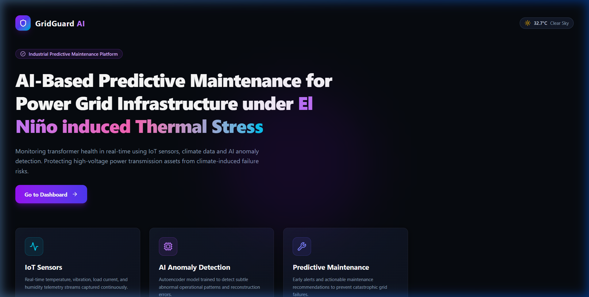
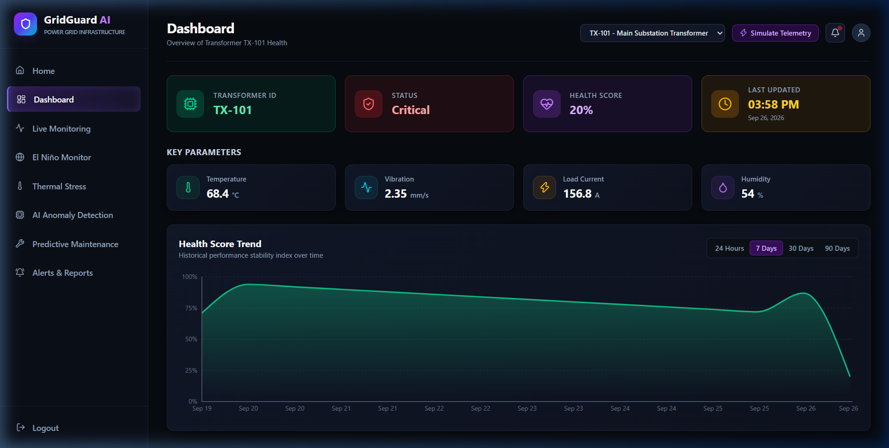
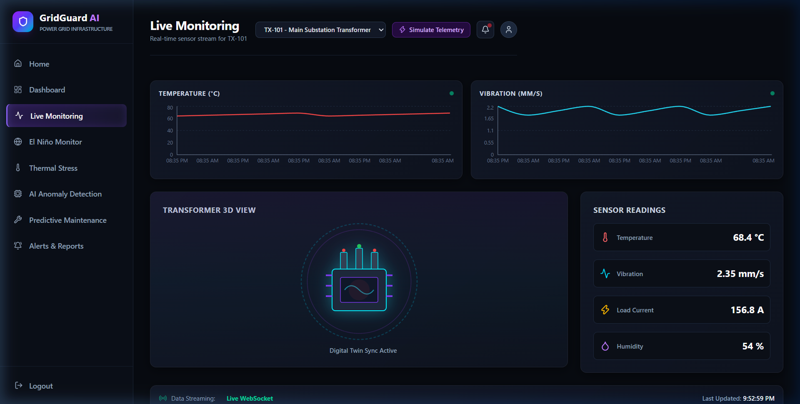
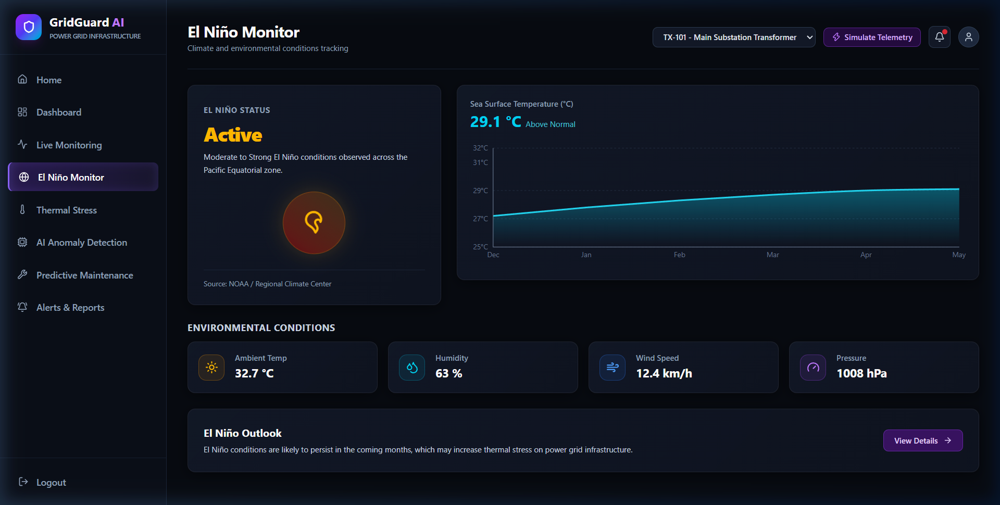
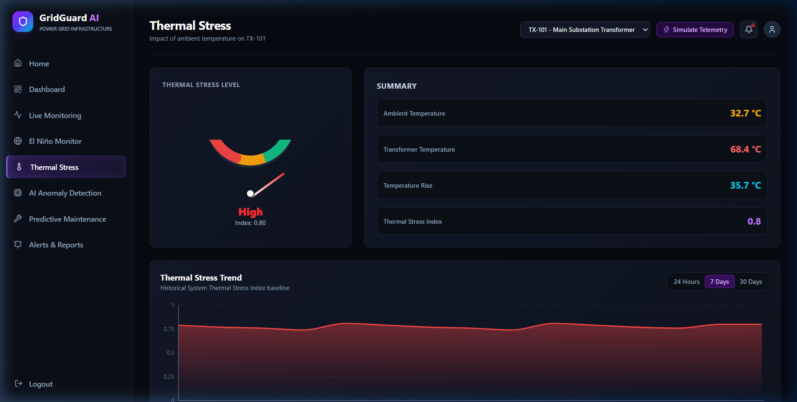
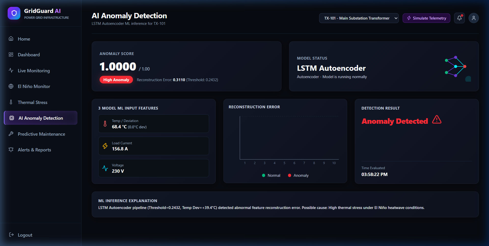
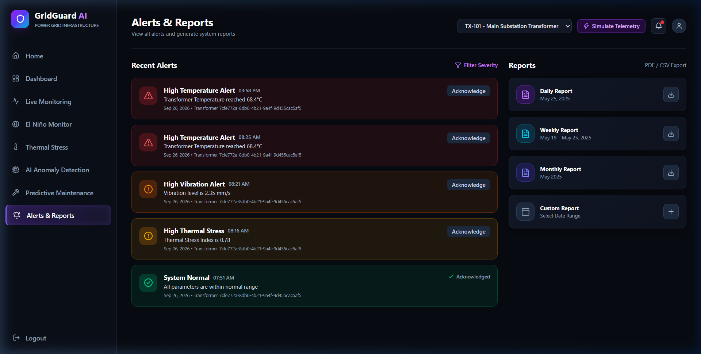
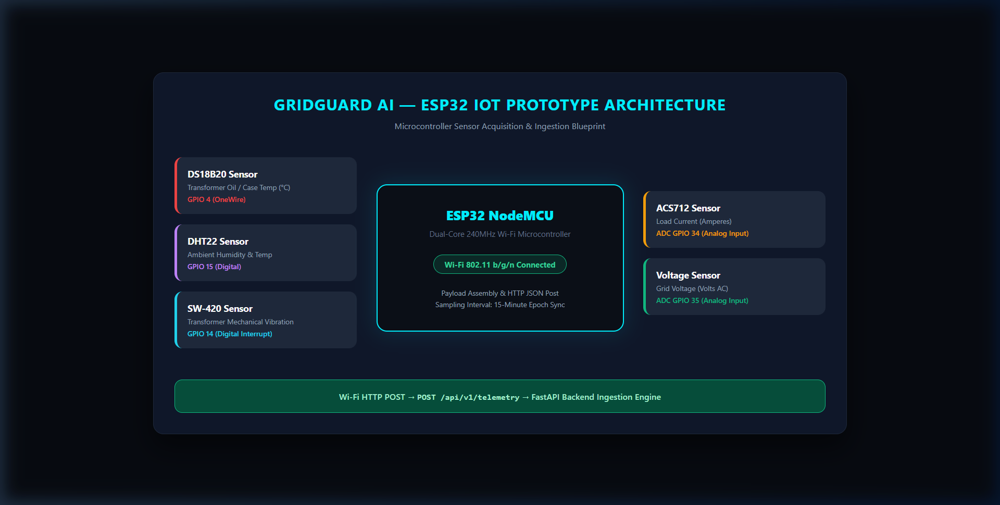

# GridGuard AI

> **AI-Based Predictive Maintenance for Power Grid Infrastructure under El Niño-Induced Thermal Stress using IoT Sensor Data**

[](https://www.python.org/)
[](https://fastapi.tiangolo.com/)
[](https://react.dev/)
[](https://www.tensorflow.org/)
[](https://vitejs.dev/)
[](https://tailwindcss.com/)
[](https://www.docker.com/)
[](LICENSE)

---

## 📌 Project Overview

**GridGuard AI** is an IoT + Machine Learning predictive-maintenance software platform for power grid transformer infrastructure. It is engineered to monitor continuous sensor telemetry, isolate thermal stress caused by extreme environmental conditions (such as El Niño heatwaves), detect anomalous operational patterns using a frozen **LSTM Autoencoder**, compute dynamic health scores, and deliver maintenance recommendations before unexpected grid failures occur.

> [!NOTE]
> GridGuard AI functions as an operational decision-support tool. It measures sequence reconstruction error against learned baseline operating patterns to highlight emerging thermal and electrical anomalies. It does not claim autonomous fault resolution or confirmed physical failure guarantees.

---

## 📸 Platform Screenshots

### 1. Home Landing Page

*Hero landing page introducing GridGuard AI's core predictive maintenance capabilities, system overview, and platform navigation.*

---

### 2. Operations Dashboard

*Executive overview presenting real-time transformer health score, operational status, key telemetry parameters (temperature, vibration, load current, humidity), and historical stability index trends.*

---

### 3. Live Monitoring

*Real-time sensor telemetry streaming view featuring dynamic sparkline charts, side parameter cards, 3D transformer model visualization, and active WebSocket connection status.*

---

### 4. El Niño Climate Monitor

*Environmental tracking dashboard displaying ENSO climate status, Sea Surface Temperature (SST) anomaly trends, ambient weather conditions, and regional thermal outlooks.*

---

### 5. Thermal Stress Analysis

*Quantitative evaluation of transformer temperature rise above ambient conditions, computing the System Thermal Stress Index under regional heatwave stress.*

---

### 6. AI Anomaly Detection

*Deep-learning inference interface displaying the LSTM Autoencoder reconstruction error scatter plot, raw model input features (`temperature_deviation`, `current`, `voltage`), threshold status (`0.2432`), and automated explanation output.*

---

### 7. Predictive Maintenance

*AI-driven decision support system showing risk levels, calculated risk scores, recommended maintenance actions, underlying thermal/electrical causes, and inspection timeframes.*

---

### 8. Alerts & Reports

*Incident management center displaying active deduplicated alerts with acknowledgement workflows alongside automated PDF/CSV report generation tools.*

---

## 🔌 System Workflow & Architecture Diagram

```
                ESP32 IoT
                    |
                    v
              FastAPI Backend
                    |
          +---------+---------+
          |                   |
          v                   v
    Transformer Data      ONI / El Niño
          |                Dataset
          v                   |
 Temperature Deviation        |
 Current                      |
 Voltage                      |
          |                   |
          v                   |
   Frozen LSTM AI             |
          |                   |
          +---------+---------+
                    |
                    v
             Decision Support
                    |
          +---------+---------+
          |                   |
          v                   v
     Anomaly/Risk       Environmental
       Detection          Context
          |                   |
          +---------+---------+
                    |
                    v
             Recommendations
```

> **Important Data Isolation Note**:  
> The El Niño/ONI dataset is used as environmental context and visualization. It is **not** an input feature of the frozen LSTM model.

---

## 🔄 End-to-End System Workflow

1. **Real IoT Monitoring / Data Ingestion**:
   - Physical ESP32 sensors or simulator send multi-parameter telemetry (`temperature`, `current`, `voltage`, `humidity`, `vibration`) to FastAPI ingestion endpoints.
2. **Simulation / Data Injection Mode**:
   - Users can test predictive maintenance without physical hardware using manual telemetry injection, 96-step scenario sequence generators, or CSV sequence uploads.
3. **Seasonal Temperature Baseline Normalization**:
   - `temperature_deviation` is computed dynamically: `temperature_deviation = actual_temperature - expected_monthly_temperature` using the saved seasonal baseline (`final_seasonal_temperature_baseline.json`).
4. **96-Step (24-Hour) Time-Series Windowing**:
   - Inference requires a rolling sequence of 96 consecutive observations at 15-minute intervals (24 hours).
5. **Frozen LSTM Autoencoder**:
   - The sequence vector `[temperature_deviation, current, voltage]` is scaled using `final_scaler.joblib` and processed by the frozen model (`final_lstm_autoencoder.keras`).
6. **Reconstruction Error Calculation**:
   - Feature-wise and overall Mean Squared Error (MSE) is computed between input sequence and reconstructed output.
7. **Anomaly Detection & Score**:
   - Reconstruction error is compared against the frozen threshold (`0.243166`).
8. **Health & Risk Score Assignment**:
   - Health score ($0-100\%$) and risk levels (`LOW`, `MEDIUM`, `HIGH`, `CRITICAL`) are calculated.
9. **El Niño / ONI Environmental Context**:
   - Regional Oceanic Niño Index (ONI) dataset is monitored in parallel to provide ambient climate context.
10. **Maintenance Decision Support**:
    - The rule-based recommendation engine combines AI anomaly results and environmental context to suggest actionable maintenance precautions.

---

### Feature Isolation Principle
The system captures 5 physical IoT telemetry metrics:
1. **Transformer Temperature** (°C)
2. **Ambient Humidity** (%)
3. **Mechanical Vibration** (mm/s)
4. **Load Current** (A)
5. **Grid Voltage** (V)

To ensure maximum model generalization, **Humidity** and **Vibration** are monitored and displayed on the Live Monitoring page as supplementary operational telemetry, but are **NOT** fed into the 3-feature AI model input vector.

The 3 features consumed by the frozen **LSTM Autoencoder** are strictly:
$$\text{Input Features} = \begin{bmatrix} \text{temperature\_deviation} \\ \text{current} \\ \text{voltage} \end{bmatrix}$$

---

## 🔩 ESP32 IoT Prototype Architecture



The ESP32 microcontroller serves as the edge telemetry acquisition device. It samples digital and analog sensors at configured intervals, formats the observations into a JSON payload, and transmits them over Wi-Fi to the FastAPI ingestion endpoint.

### Sensor Hardware Mapping
| Sensor Component | Physical Variable | Microcontroller Interface | Operating Range |
| :--- | :--- | :--- | :--- |
| **DS18B20** | Transformer Temperature | GPIO 4 (OneWire) | -55°C to +125°C |
| **DHT22** | Ambient Humidity & Temp | GPIO 15 (Digital) | 0–100% RH / -40°C to +80°C |
| **SW-420** | Mechanical Vibration | GPIO 14 (Digital Interrupt) | Digital Motion / Vibration |
| **ACS712 (30A)** | Transformer Load Current | ADC GPIO 34 (Analog) | 0 to 30A AC/DC |
| **AC Voltage Module** | Grid Voltage | ADC GPIO 35 (Analog) | 0 to 250V AC |

---

## 🤖 Machine Learning Pipeline

```
Raw Telemetry (Temp, Current, Volt)
            │
            ▼
Seasonal Temperature Normalization (Temp Dev = Temp - Expected_Month_Temp)
            │
            ▼
Sequence Assembly (96 timesteps × 3 features = 24-Hour Window)
            │
            ▼
Feature Scaling (final_scaler.joblib)
            │
            ▼
LSTM Autoencoder Reconstruction (final_lstm_autoencoder.keras)
            │
            ▼
Mean Squared Error (MSE) Calculation
            │
            ▼
Threshold Evaluation (Fixed Threshold = 0.243166)
            │
            ▼
Health Score & Risk Category Assignment (LOW, MEDIUM, HIGH, CRITICAL)
```

### Model Architecture Details
The frozen model is an **LSTM Autoencoder** trained on 15-minute resolution time-series data:

```
Layer (type)                      Output Shape         Param #
=================================================================
InputLayer                        (None, 96, 3)        0
LSTM (Encoder Layer 1)            (None, 96, 64)       17,408
LSTM (Encoder Layer 2)            (None, 32)           12,416
RepeatVector                      (None, 96, 32)       0
LSTM (Decoder Layer 1)            (None, 96, 32)       8,320
LSTM (Decoder Layer 2)            (None, 96, 64)       24,832
TimeDistributed(Dense)            (None, 96, 3)        195
=================================================================
Total params: 63,171
Trainable params: 63,171
```

### Hyperparameters
- **Input Shape**: `96 × 3` (96 timesteps of 15-minute intervals = 24 hours)
- **Optimizer**: Adam ($\text{lr} = 0.001$)
- **Batch Size**: 64
- **Loss Function**: Mean Squared Error (MSE)
- **Callbacks**: `EarlyStopping(patience=15)`, `ReduceLROnPlateau(factor=0.5, patience=5)`

---

## 📊 Verified Model Performance Metrics

The model was evaluated using a **month-stratified blocked temporal holdout** strategy:

| Metric | Verified Value |
| :--- | :--- |
| **Total Dataset Rows** | 18,283 |
| **Total Window Sequences** | 14,156 |
| **Normal Training Windows** | 11,836 |
| **Validation Windows** | 1,032 |
| **Test Windows** | 1,166 |
| **Best Training Loss (MSE)** | `0.066674` |
| **Best Validation Loss (MSE)** | `0.082504` |
| **Saved Decision Threshold** | `0.243166` (95th percentile of normal validation error) |
| **Test Set Anomaly Count** | 21 windows |
| **Test Set Anomaly Rate** | **1.80%** |

### Test Set Risk Category Distribution
- **LOW Risk**: 1,097 windows (94.08%)
- **MEDIUM Risk**: 33 windows (2.83%)
- **HIGH Risk**: 36 windows (3.09%)
- **CRITICAL Risk**: 0 windows (0.00%)

---

## 🌡️ Temperature Normalization & Feature Engineering

Under El Niño conditions, ambient temperatures increase dramatically, causing transformer temperatures to rise naturally. To prevent the model from misclassifying ordinary summer heat as a structural hardware failure, the system applies **Seasonal Baseline Subtraction**:

$$\text{temperature\_deviation} = T_{\text{measured}} - T_{\text{baseline}}(m)$$

Where $T_{\text{baseline}}(m)$ is the historical median temperature for month $m$ derived exclusively from normal training data:

| Month | Jan | Feb | Mar | Apr | Jun | Jul | Aug | Sep | Oct | Nov | Dec |
| :--- | :---: | :---: | :---: | :---: | :---: | :---: | :---: | :---: | :---: | :---: | :---: |
| **Baseline (°C)** | 19.0 | 21.0 | 27.0 | 29.0 | 33.4 | 29.0 | 29.0 | 29.0 | 27.0 | 25.0 | 22.0 |

---

## 🧮 Health & Risk Scoring Formulas

1. **Reconstruction Error Standard Normalization ($z$-score)**:
   $$z = \frac{\text{reconstruction\_error} - \mu_{\text{val}}}{\sigma_{\text{val}}}$$
   *(where $\mu_{\text{val}} = 0.082504$ and $\sigma_{\text{val}} = 0.060983$)*

2. **Anomaly Score**:
   $$\text{anomaly\_score} = \text{clip}\left( \frac{z}{5.0}, \, 0.0, \, 1.0 \right)$$

3. **Health Score**:
   $$\text{health\_score} = 100.0 \times (1.0 - \text{anomaly\_score})$$

4. **Risk Classification**:
   - **LOW**: $\text{anomaly\_score} < 0.20$ ($\text{Health} \ge 80\%$)
   - **MEDIUM**: $0.20 \le \text{anomaly\_score} < 0.40$ ($60\% \le \text{Health} < 80\%$)
   - **HIGH**: $0.40 \le \text{anomaly\_score} < 0.70$ ($30\% \le \text{Health} < 60\%$)
   - **CRITICAL**: $\text{anomaly\_score} \ge 0.70$ ($\text{Health} < 30\%$)

---

## 🚀 Key Features

- ⚡ **Real-Time Telemetry Ingestion**: High-throughput FastAPI endpoints receiving multi-sensor IoT payloads.
- 🔄 **WebSocket Live Streaming**: Low-latency bidirectional updates pushing live telemetry to frontend cards and sparklines.
- 🧠 **LSTM Autoencoder Anomaly Detection**: Deep-learning reconstruction error analysis for early anomaly detection.
- 🌡️ **Thermal Stress Engine**: Real-time evaluation of transformer heat rise under El Niño weather patterns.
- 🛠️ **Predictive Maintenance Recommendations**: Automated maintenance advice, cause diagnosis, and inspection timeframes.
- 🔔 **Alert Management**: Deduplicated alerts with 15-minute cooldown windows and active acknowledgement workflows.
- 📄 **PDF & CSV Report Generation**: Automated ReportLab PDF summary reports for Daily, Weekly, and Monthly logs.
- 🎛️ **Multi-Transformer Switching**: Instant selection between grid transformers (`TX-101`, `TX-102`) updating all metrics.
- 🧪 **Development Simulator**: Integrated background telemetry generator for demonstration and offline testing.

---

## 📡 API Endpoint Reference

| Method | Endpoint | Description |
| :--- | :--- | :--- |
| `POST` | `/api/v1/telemetry` | Ingest IoT sensor payload from ESP32 or simulator |
| `GET` | `/api/v1/dashboard/summary` | Fetch dashboard summary, key metrics, and health trends |
| `GET` | `/api/v1/anomaly` | Get latest LSTM Autoencoder anomaly status & reconstruction history |
| `GET` | `/api/v1/maintenance` | Get predictive maintenance risk, reasons, and recommendations |
| `GET` | `/api/v1/transformers` | List registered grid transformers |
| `GET` | `/api/v1/transformers/{id}/telemetry` | Retrieve historical sensor readings for a transformer |
| `GET` | `/api/v1/thermal-stress` | Fetch thermal stress index, ambient temperature, and rise trend |
| `GET` | `/api/v1/environment/summary` | Get El Niño ENSO status, sea surface temperature, and weather |
| `GET` | `/api/v1/alerts` | Retrieve active or historical system alerts |
| `PATCH`| `/api/v1/alerts/{id}/acknowledge` | Acknowledge an active alert |
| `GET` | `/api/v1/reports` | List generated reports |
| `GET` | `/api/v1/reports/{type}/download` | Download PDF or CSV report for daily/weekly/monthly periods |
| `POST` | `/api/v1/dev/simulate` | Manually trigger a simulated IoT telemetry tick |
| `WS`   | `/ws/transformers/{id}` | Real-time WebSocket telemetry stream |

### Sample Telemetry Ingestion Payload
`POST /api/v1/telemetry`
```json
{
  "transformer_id": "TX-101",
  "timestamp": "2026-09-26T20:30:00Z",
  "temperature": 68.4,
  "ambient_temperature": 32.7,
  "humidity": 54.0,
  "vibration": 2.35,
  "current": 156.8,
  "voltage": 230.0,
  "power_factor": 0.95
}
```

---

## 🛠️ Local Setup & Installation

### Prerequisites
- **Python**: `3.10` or `3.11`
- **Node.js**: `18+` or `20+`
- **npm**: `9+`

### 1. Backend Setup
```bash
# Navigate to backend directory
cd backend

# Create virtual environment
python -m venv venv

# Activate virtual environment
# Windows:
.\venv\Scripts\activate
# Linux/macOS:
source venv/bin/activate

# Install dependencies
pip install -r requirements.txt

# Run database migrations / initialization
python seed.py

# Start FastAPI server
python -m uvicorn app.main:app --host 0.0.0.0 --port 8000 --reload
```
- **Backend API**: `http://localhost:8000`
- **Interactive Swagger Docs**: `http://localhost:8000/docs`

---

### 2. Frontend Setup
```bash
# Navigate to frontend directory
cd frontend

# Install dependencies
npm install

# Start Vite development server
npm run dev -- --port 3000
```
- **Frontend Dashboard**: `http://localhost:3000`

---

## 🐳 Docker Deployment

The repository includes a complete multi-container Docker configuration.

```bash
# Build and start services using Docker Compose
docker compose up --build -d

# View running containers
docker compose ps

# Check backend logs
docker compose logs -f backend
```

---

## 📁 Repository Directory Structure

```
El-Nino/
├── backend/
│   ├── app/
│   │   ├── api/routes/       # FastAPI endpoints (telemetry, anomaly, maintenance, ws, etc.)
│   │   ├── core/             # Database configuration, security, CORS settings
│   │   ├── models/           # SQLAlchemy ORM database models
│   │   ├── schemas/          # Pydantic request & response data schemas
│   │   └── services/         # Business logic (ML service, thermal stress, alerts, reports)
│   ├── models/               # Frozen ML model artifacts (.keras, .joblib, .json)
│   │   ├── final_lstm_autoencoder.keras
│   │   ├── final_scaler.joblib
│   │   ├── final_seasonal_temperature_baseline.json
│   │   ├── final_model_metadata.json
│   │   └── final_metrics.json
│   ├── seed.py               # Database seed script for initial transformers & telemetry
│   └── requirements.txt      # Python backend dependencies
├── frontend/
│   ├── src/
│   │   ├── components/       # UI cards, charts, gauges, status badges, layout header
│   │   ├── context/          # React Context (TransformerContext, AuthContext)
│   │   ├── pages/            # 8 Dashboard pages (Home, Dashboard, Anomaly, Maintenance, etc.)
│   │   └── services/         # Centralized Axios API wrapper & WebSocket connector
│   ├── package.json          # Node.js dependencies
│   └── vite.config.js        # Vite build & API proxy setup
├── ml_training/
│   ├── gridguard_autoencoder_training.ipynb  # Google Colab Autoencoder training notebook
│   └── gridguard_colab_training.py           # Standalone Python model training script
├── docs/
│   ├── architecture.md       # Architectural specification document
│   ├── esp32_diagram.html    # ESP32 IoT diagram layout
│   └── screenshots/          # Real application UI screenshots (01 to 09)
├── docker-compose.yml        # Docker compose container orchestrator
└── README.md                 # System documentation
```

---

## ⚠️ Known Limitations

1. **No Ground-Truth Fault Labels**: The training dataset does not contain labeled hardware fault classes. The model detects statistical reconstruction deviations from normal operating patterns.
2. **Anomaly Score $\neq$ Failure Probability**: An anomaly score represents the distance of current sensor patterns from learned normal operation. It does not calculate exact component Remaining Useful Life (RUL).
3. **Sequence History Requirement**: Live ML inference requires a rolling sequence of 96 observations (24 hours of consecutive 15-minute sensor data).
4. **3 AI Model Input Features**: Humidity and vibration are monitored on the dashboard for environmental visibility, but are excluded from the current 3-feature Autoencoder inference input vector.

---

## 🔒 Security Best Practices

- Development secret keys and JWT tokens should be replaced with strong random strings in production environments.
- Environment configurations should be managed via `.env` files and never committed to public repositories.
- Cross-Origin Resource Sharing (CORS) origins must be explicitly specified when exposing API endpoints.

---

## 🔮 Future Work

- [ ] Incorporate labeled fault datasets to support multi-class defect classification (e.g., winding short circuit, oil degradation).
- [ ] Train multi-variate Autoencoder including humidity and vibration when long-term correlated training data is available.
- [ ] Integrate native MQTT broker listener for low-bandwidth cellular IoT deployments.
- [ ] Implement cloud-native automated retraining pipeline with continuous MLflow tracking.

---

## 📜 License

This project is licensed under the MIT License - see the [LICENSE](LICENSE) file for details.
